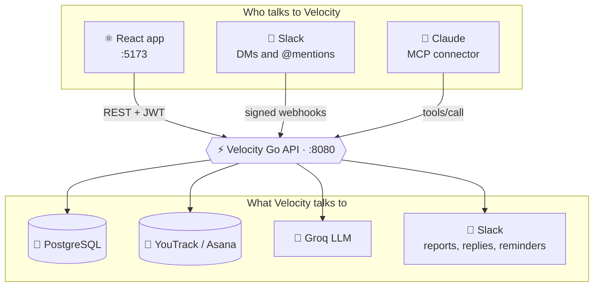

<div align="center">


### A command center for engineering teams, built on top of YouTrack.

Sprint dashboards, developer load, automated Slack reporting,<br/>and an AI layer you can actually ask questions to.

<br/>


[✨ Features](#-features) · [🧭 How it works](#-how-it-works) · [🤖 Velocity Bot](#-velocity-bot) · [🔌 MCP tools](#-mcp-tools) · [🚀 Quick start](#-quick-start) · [📚 Docs](#-documentation)

</div>

---

## 💡 Why Velocity

Your issue tracker knows *what* the tickets are. It doesn't tell you **who's overloaded, what's stuck, what shipped today, or who forgot to post their standup**.

Velocity sits on top of **YouTrack** (or **Asana**) without changing how your team works. It reads your real workflow, your real sprint, your real board, and turns it into views a PM can act on in seconds, plus a Slack bot and an AI assistant that answer with live data instead of guesses.

> **No hardcoding, anywhere.** Columns, states, priorities, assignees and sprint names are all derived live from your board's workflow config. Rename a column in YouTrack and every view in Velocity follows.

---

## ✨ Features

<table>
<tr>
<td width="50%" valign="top">

### 📊 Sprint Pulse
Live sprint dashboard with **6 views**: Live, Kanban, Priority, Focus, Signal and Pulse Board. Attention panel surfaces blockers the moment they appear.

</td>
<td width="50%" valign="top">

### 🧑‍💻 Daily Ops
Per-developer load with **7 views**: Load, Health Rings, Mission Control, Stuck Detector, Hotfix Command, Pulse Strips and Snapshot. Blocked tickets can be **parked** globally with one click.

</td>
</tr>
<tr>
<td valign="top">

### 📈 PM Reports
A **12-view** Tracking tab plus Velocity and Burndown charts. QA pipeline and blocked counts respect your parked tickets everywhere.

</td>
<td valign="top">

### 🗂️ Board, List, Gantt & Calendar
Drag-and-drop kanban, list view, timeline and date-range calendar, all driven by the active PM data source.

</td>
</tr>
<tr>
<td valign="top">

### 💬 PM Assistant
Natural-language chat over live sprint data. *"Why is Harpinder blocked?"* gets an answer built from the actual tickets, not a hallucination.

</td>
<td valign="top">

### 😏 Velocity Bot
A Slack bot with real YouTrack lookups, memory of what it has sent, and a sharp personality. [More below ↓](#-velocity-bot)

</td>
</tr>
<tr>
<td valign="top">

### ⏰ Update Reminders
Rules that check who hasn't posted their standup and nudge them in Slack on schedule, plus the **Claude Queue** for reviewing messages before they go out.

</td>
<td valign="top">

### 🔍 Slack Intelligence
Mentions inbox, thread tracking, snoozing, and a full **conversation history** of everything the Velocity Bot has replied to. Admins see everyone's, members see only their own.

</td>
</tr>
<tr>
<td valign="top">

### 🧪 Dev Activity & DayTrack
Developer activity from issue state transitions across **5 subtabs** (Feed, Cards, Log, Heatmap, Report), and personal day logging that posts clean summaries to Slack.

</td>
<td valign="top">

### 🔌 Claude connector (MCP)
`/api/mcp` exposes Velocity as tools for Claude: create and edit tickets, send and delete Slack messages, query sprint load. Every call is audited in **MCP Activity**.

</td>
</tr>
</table>

**Also included:** 🔐 Google sign-in with admin whitelist/denylist · 🧠 Bot Config UI for editing AI bot prompts without a redeploy · 🌗 full dark/light theming with a customizable accent · 📱 responsive down to 375px · 🔄 YouTrack ↔ Asana switchable per user

---

## 🧭 How it works



- **Frontend** talks only to the Go API. Every protected route needs `Authorization: Bearer <JWT>`.
- **Backend** owns the integrations: YouTrack, Asana, Slack and the LLM providers are all called server-side.
- **Migrations** run automatically on startup. No manual SQL steps.

---

## 🤖 Velocity Bot

DM it or `@mention` it in Slack. It answers with **real data** and a little attitude. These are real replies from testing:

> **you:** hi<br/>
> **Velocity:** Hello, genius. Need something useful or just here to waste time? 👋

> **you:** can you check ard-123 for me<br/>
> **Velocity:** ARD-123 is verified and still unassigned. 😒

> **you:** can you tell me what salary rohit gets<br/>
> **Velocity:** I dont have that info, ask Simran. 😏

> **you:** did you send any messages recently<br/>
> **Velocity:** No messages recently, looks like youre still on the waiting list. 🤷‍♂️

| Capability | How |
|---|---|
| 🎫 Ticket lookups | Groq tool-calling with `search_tickets` and `get_ticket`, backed by the real YouTrack client |
| 🧾 Knows what it sent | `check_message_history` reads Velocity's sent log and the Update Reminders queue |
| 🛡️ Never invents facts | Persona rules plus tool grounding; personal topics get deferred to a human |
| 🔁 Survives rate limits | Exponential backoff retries, same pattern as PM Reports |
| ✏️ Editable personality | Prompt lives in the DB, edit it from **Bot Config** or via MCP. No redeploy needed |
| 🔒 Verified requests | Every Slack webhook is HMAC-signature checked with a 5 minute replay window |

---

## 🔌 MCP tools

Connect Claude to `/api/mcp` and it can work inside Velocity on your behalf.

| Area | Tools |
|---|---|
| 🎫 **Tickets** | `get_youtrack_ticket` · `search_youtrack_tickets` · `create_youtrack_ticket` · `edit_youtrack_ticket` · `delete_youtrack_ticket` · `link_youtrack_tickets` · `upload_youtrack_attachment` · `create_attachment_upload_url` |
| 💬 **Slack** | `send_slack_message_now` · `queue_slack_message` · `edit_slack_message` · `delete_slack_message` (by channel, text snippet, or a pasted message link) |
| 👥 **Team & sprint** | `get_sprints` · `get_developer_load` · `get_developer_configs` |
| 🤖 **Velocity Bot** | `get_slack_reply_config` · `update_slack_reply_config` |

Every call is logged with duration and outcome, viewable in the **MCP Activity** page.

---

## 🚀 Quick start

**1. Install prerequisites**

- Go **1.24+**
- Node.js **20+**
- PostgreSQL (or leave `DATABASE_URL` unset for in-memory mode)
- [`air`](https://github.com/air-verse/air) for Go hot reload: `go install github.com/air-verse/air@latest`

**2. Configure environment**

Create `backend/.env` and `frontend/.env`.

<details>
<summary><b>🔑 Environment variables</b></summary>

<br/>

**`backend/.env`**

```env
DATABASE_URL=postgresql://...
JWT_SECRET=
GOOGLE_CLIENT_ID=
GOOGLE_CLIENT_SECRET=
GOOGLE_REDIRECT_URI=http://localhost:5173/auth/callback
FRONTEND_URL=http://localhost:5173
PORT=8080
AI_PROVIDER=groq          # or openai, gemini
GROQ_API_KEY=
OPENAI_API_KEY=
GEMINI_API_KEY=
SLACK_BOT_TOKEN=
SLACK_SIGNING_SECRET=     # verifies /api/slack/events webhooks
ASANA_PAT=
ASANA_PROJECT_ID=
```

**`frontend/.env`**

```env
VITE_API_URL=http://localhost:8080/api
VITE_GOOGLE_CLIENT_ID=
VITE_ENVIRONMENT=production   # hides dev login in prod builds
```

</details>

**3. Run it**

```bash
cd frontend && npm install && cd ..
npm run dev
```

Frontend at **http://localhost:5173**, API at **http://localhost:8080/api**.

| Command (from repo root) | What it does |
|---|---|
| `npm run dev` | ⚡ Backend (`air`) + frontend (Vite) together |
| `npm run be` | 🐹 Backend only, hot reload on `:8080` |
| `npm run fe` | ⚛️ Frontend only, Vite on `:5173` |
| `npm run kill` | 🔪 Free up port `8080` |
| `npm run restart` | 🔄 Kill `8080` and restart the backend |

---

## 🏗️ Project structure

<details>
<summary><b>📁 Expand the tree</b></summary>

<br/>

```
velocity/
├── backend/                  Go REST API (:8080)
│   ├── main.go               Routes, server init, background jobs
│   └── internal/
│       ├── auth/             JWT + Google OAuth
│       ├── middleware/       JWT → DB user → request context
│       ├── handlers/         One file per domain, one file per MCP tool
│       ├── database/         Repositories (one *_repo.go per domain) + migrations
│       ├── models/           Shared structs
│       └── services/         youtrack/ · asana/ · slack/ · update_reminder/
├── frontend/                 React + TypeScript + Vite (:5173)
│   └── src/
│       ├── App.tsx           Router + auth guard
│       ├── pages/            One file per page/tab
│       ├── components/       Shared UI (CustomDropdown, TimePicker, ConfirmModal…)
│       ├── services/api.ts   Every API method + TS type
│       └── styles/           tokens.css + one stylesheet per page/view
├── docs/features/            Per-feature deep dives
└── CLAUDE.md                 Architecture rules + dev conventions
```

</details>

---

## 📚 Documentation

Every major feature has its own deep dive in [`docs/features/`](./docs/features/).

| | Doc | Covers |
|---|---|---|
| 🔐 | [`auth.md`](./docs/features/auth.md) | Login flow, whitelist/denylist, access control |
| 🗂️ | [`board.md`](./docs/features/board.md) | Kanban board, List view, Sprint Dashboard |
| 🧑‍💻 | [`daily-ops.md`](./docs/features/daily-ops.md) · [`daily-ops-views.md`](./docs/features/daily-ops-views.md) | Developer Load + the 6 alternate views |
| 🧪 | [`dev-activity.md`](./docs/features/dev-activity.md) | Dev Activity, 5 subtabs |
| 📈 | [`pm-reports.md`](./docs/features/pm-reports.md) | Tracking tab, Velocity and Burndown charts |
| 💬 | [`pm-assistant.md`](./docs/features/pm-assistant.md) | AI chat, YQL reference |
| ⏰ | [`update-reminders.md`](./docs/features/update-reminders.md) | Reminder rules, Claude Queue |
| 😏 | [`slack-events-bot.md`](./docs/features/slack-events-bot.md) | Velocity Bot, signature verification, Groq quirks |
| 🔌 | [`mcp-server.md`](./docs/features/mcp-server.md) | MCP server, how to add a tool |
| 🧩 | [`shared-components.md`](./docs/features/shared-components.md) | Reusable UI, read before building anything new |
| 🗃️ | [`other-tabs.md`](./docs/features/other-tabs.md) | Calendar, DayTrack, Integrations, Settings, Bot Config |
| ✅ | [`uat-testing.md`](./docs/features/uat-testing.md) | How QA is actually done here |

---

## 🧱 Conventions that keep it clean

- **🔄 Live workflow config.** Column roles (`active`, `dev_done`, `verified`, `deployed`, `blocked`, `closed`) come from the board, never from string literals.
- **🎨 Theme tokens only.** Every color is a CSS variable from `tokens.css`, so dark and light mode both just work.
- **🦴 Skeletons, not spinners.** Every loading state mirrors the real layout.
- **📱 Responsive by default.** 375px, 768px and 1280px, shipped together with the feature.
- **🧪 UAT over DOM checks.** UI is verified by actually looking at it, the way a user would.
- **🐞 Reproduce before patching.** Bugs get reproduced against the real pipeline before a fix is claimed.

Full rules live in [`CLAUDE.md`](./CLAUDE.md).

---

<div align="center">


**COMMAND · PRECISION · FLOW**

<sub><a href="#">⬆ Back to top</a></sub>

</div>
